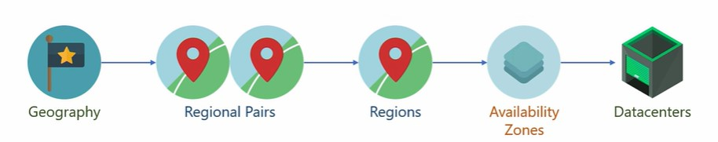
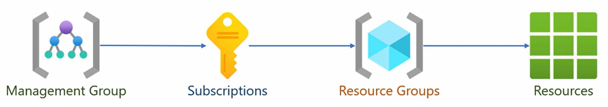

# ☁️ Azure Architecture and Security

- [☁️ Azure Architecture and Security](#️-azure-architecture-and-security)
  - [📐 Understand Azure Architecture](#-understand-azure-architecture)
    - [🌎 Azure Global Infrastructure Overview](#-azure-global-infrastructure-overview)
    - [💵 Subscriptions](#-subscriptions)
    - [🏢 Management Groups](#-management-groups)
    - [💼 Resources Groups](#-resources-groups)
    - [Resources](#resources)
  - [📁 Azure Active Directory](#-azure-active-directory)
  - [🔒 Azure Security](#-azure-security)
  - [🎯 Conclusion](#-conclusion)

## 📐 Understand Azure Architecture

### 🌎 Azure Global Infrastructure Overview

1. **Geography**: typically a country. Has a boundary, government, and national laws. Helps meet shared regulations, compliance, and data residency requirements of a country. Contains one or more Azure Regions.
2. **Region**: is a part within the geography. Contains one or more Availability Zones (AZ). When region has >= 3 AZ, it is said to be Availability Zone-enabled. Microsoft may tie regions into a **regional pair**, linked with dedicated low-latency WAN links (<20ms). It facilitates cross-region data replication for High Resiliency. Pairing can be uni (rarer) or bi-directional (because of size).
3. **Availability Zones**: AZ are areas within a region. Its role is to provide redundancy within a region. Dedicated high-performance networks (<2ms). Zonal (< 3 AZ) or zone-redundant replication. Contains 1 or more Datacenters.
4. **Datacenters**: Physical building.

### 💵 Subscriptions

Subscription is a unit of consolidated billing. Usually monthly. Organizations may use one or more subscriptions.

### 🏢 Management Groups

A Management Group manages a subscription. Every subscription must be in a Management group. Tenant Root Group is provisioned at first sign-up. Control access, policies and compliance.

### 💼 Resources Groups

Resource group is a set resources within a subscription. Groups resources pertaining to an application or a solution. Manage shared permissions, policies and lifecycle. It is associated with a region. However it can hold resources from any other region.

###  Resources

Resources in the cloud are the end objects in the Azure Hierarchy. It is an instance of a cloud service. It can be a IaaS, PaaS and a SaaS resource. They provide 3 main functions: compute, networking and storage. **Resources are charged** on type and configuration.

## 📁 Azure Active Directory

## 🔒 Azure Security

## 🎯 Conclusion