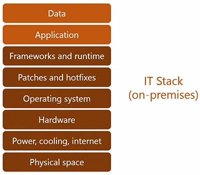
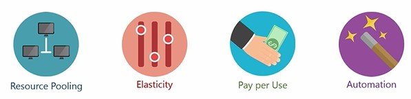
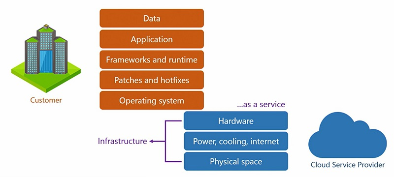
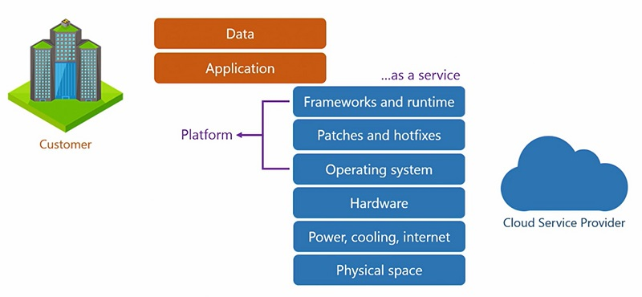
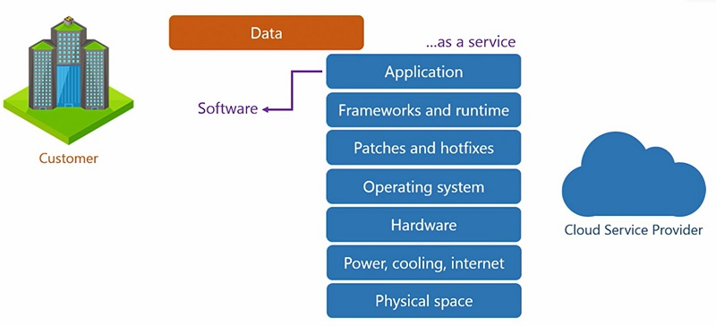
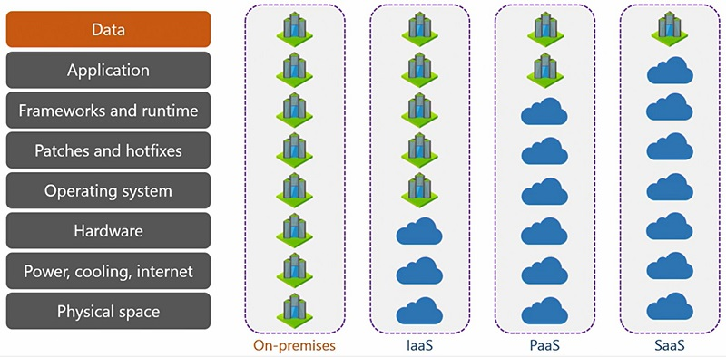

# 📖 Microsoft Azure Fundamentals AZ-900
Study notes for Microsoft certification AZ-900.
Sources:
- Linked Learning path: [Prepare for the Microsoft Azure Fundamentals (AZ-900) Certification Exam](https://www.linkedin.com/learning/paths/prepare-for-the-microsoft-azure-fundamentals-az-900-certification-exam?u=2216250)
  - [Cert Prep: 1 Cloud Concepts](https://www.linkedin.com/learning/microsoft-azure-fundamentals-az-900-cert-prep-1-cloud-concepts/hello-cloud-9706287?contextUrn=urn%3Ali%3AlyndaLearningPath%3A5d8bb5f9498e3236cc92196a&u=2216250)
  - [Cert Prep: 2 Azure Architecture and Security](https://www.linkedin.com/learning/microsoft-azure-fundamentals-az-900-cert-prep-2-azure-architecture-and-security/hello-azure?contextUrn=urn%3Ali%3AlyndaLearningPath%3A5d8bb5f9498e3236cc92196a&u=2216250)
- Microsoft Learning: [Microsoft Azure Fundamentals: Describe cloud concepts](https://learn.microsoft.com/en-us/training/paths/microsoft-azure-fundamentals-describe-cloud-concepts/)
___
## 📝 Exam curriculum

- Describe Cloud Concepts: 25-30%.
- Describe Azure Architecture and Services: 35-40%
- Describe Azure Management and Governance: 30-35%

### ☁️ What is Cloud Computing?

#### The traditional IT stack

"Cloud computing is the delivery of any computing resources from the IT stack as a service, by a cloud service provider"

#### 🖥️ Virtualization

Virtualization is the core foundation of all cloud computing. It is basically the creation of virtual **processor**, **memory**, and **hard disk**. This enables the delivery of those components  over the network. Also provides isolation between instances of virtualized resources.

#### 🌨️ Key characteristics of Cloud Computing

**1. Resource pooling:** Large pool of virtualized computing resources
**2. Elasticity:** Enables increasing and decreasing the provisioned resources as demand varies.
**3. Pay per use:** You pay only for the resources you use and the time you use them for
**4. Automation:** Enables the user to provision resources on demand and perform self-service on resources without depending on anyone. Neither the CSP, tech support, nor anybody else

#### 💽 Cloud computing offering models

There are 3 cloud service models of how computing resources can be offered to customers. Azure provides all 3.
##### 1. Infrastructure-as-a-Service (IaaS)

The cloud provides access to virtualized hardware resources. The customer gets maximum control of the application environment, but it must handle a bigger part of the stack (OS, frameworks, etc).

##### 2. Platform-as-a-Service (PaaS)

Customer can get up and running with their application quickly without having to deal with unnecessary configuration. The disadvantage is less control of the environment. It is the most popular cloud service offering among businesses.

##### 2. Software-as-a-Service (SaaS)

Cloud provides the application configured and ready to use. Usually only the most popular applications are available.

##### Shared Responsibility Model

Both the Customer and Cloud Service Provider are responsible for the application uptime and security. The share of responsibility each of them bears varies depending on the type of service model.

## 🌥️ Types of Cloud Computing

### 1. Public Cloud

Offers services to many customers often over the public internet. Open to anyone to pay for and consume. Organizations that consume these services are called tenants. It is a multi-tenant cloud. Very economical because public cloud providers run on a low cost-high volume strategy.

### 2. Private Cloud

Some companies have policies that limits the use of public Clouds for various reasons (compliance, data center location, laws, security). A private Cloud is when the whole stack is created and managed by the organization. But why? It can deliver efficiency, streamlining process, striving for operational excellence and implement best practices. Usually only medium or large enterprises uses private Cloud because of the cost, technical complexity, and effort involved. Some venders can setup and hand over private Clouds. In Microsoft, this service is called Azure Stack.

### 3. Hybrid Cloud

Combination of Public and Private Cloud.
### 4. Sovereign Cloud

Used by National Governments to process and store sensitive information.

## ✅ Benefits of Cloud Computing

### 👟 Elasticity

To be considered elastic, the infrastructure pool must be able to assign resources to an application, provide extra resources when an application requests it, and reclaim it when the application does not need it anymore. A cloud should always have an elastic infrastructure. And, therefore, elasticity is a core benefit of the cloud. The cloud service provider is responsible for ensuring elasticity in all three service models, IaaS, PaaS, and SaaS. Remember, elasticity is an attribute of the infrastructure.

### ⛰️ Scalability

When an application scale vertically or horizontally it is said to be **scalable**. An application can only be scalable if it is supported by an elastic infrastructure.

**1. Vertical Scaling:** Scale up to increase the instance resources to sustain bigger demand. Scale down when there is no demand.
**2. Scale horizontally:** Scale out: increase the amount of instances to sustain bigger demand. Scale in: turning off the additional instances.

The customer is responsible for implementing scalability in applications for IaaS and PaaS. But for SaaS, the cloud service provider takes care of the application scalability. Remember, scalability is an attribute of the **application**.

### ⏲️ High Availability

The purpose of high-availability is to minimize application downtime and maximize uptime, keep the application available for as long as possible, hence the term, high-availability.

Planned failover vs unplanned failover.

The uptime for services is defined in a document called the Service Level Agreement and measured in percentage. For example, if a service claims to have a 99.999% uptime in its SLA, we call it five nines because there are five nines, 99.999 and if the uptime is five nines, the downtime is 0.001%. That roughly translates to five and a half minutes of downtime per year. For context, a year has more than half a million minutes, 525,600 minutes to be precise. This means the service may go down for a combined five and a half minutes over a period of one year.

### 💥 Fault Tolerance

It is topically an attribute of the operating system. At any given moment, the system may experience an unexpected event called a fault. This could be due to an exception, error, interrupt, or any other fault in the software or hardware components like the processor, memory, and disc. If you are wondering how a fault is different from a failure, a **fault** is instantaneous and temporary, but a **failure** is usually a longer lasting event and needs greater effort to resolve.

A system is said to be fault tolerant if it can preserve the system state when the fault occurs and continue to process the information it was processing without breaking the flow at that given instant. A system that can sustain this successfully is said to have **fault tolerance**, or else it does not. This feature is usually built into the operating system, and thus is not something we need to manage. The cloud service provider takes care of it in all service models.

### 🌊 Disaster Recovery

We need to ensure data is safe from larger impacts, even if the probability of such occurrences is low. A disaster is a large-scale catastrophic event that has the potential to take down an entire region, including one or more data centers.

From an IT perspective, preserving the **integrity of data** in such situations is a high priority. Typically, data is stored on servers in the on-premises environment. To avoid losing the data, we take backups. Depending on how critical the data is, the backup schedule can be hourly, daily, weekly, or monthly.

Local backups cannot protect data from disasters. That's because both the servers and backups are on the same site, on premises. A disaster will wipe out both. That's why we need disaster recovery. In this strategy, we store backups of the data off site in a physically distant location that's planned in a way that a disaster does not affect them both together. We call this an off-site backup.

You can make the cloud your off-site backup destination at a mere fraction of the cost. The cloud can be the secondary site to your primary site on premises. This means even if your entire primary site goes down, your data is completely safe in the cloud.

### 🔐 Security in the Cloud

A Cloud should be **security-centric**. The data should be protected with industry standard **encryption** when it's addressed and in transit. Doing this prevents bad actors from getting access to readable data when it's stored in the cloud or being moved from one point to another.

Administrators should also have tools for **identity** and **access management** at their disposal. This helps protect user accounts, passwords, groups, and devices from bad actors. Leaked passwords and stolen devices are the most common weak links in any organization.

There should be a multi-layered approach to security for end-to-end protection. Because security is not just about protecting one or two parts, it's about protecting the whole string of components. Ideally, there should be multiple barriers to entry, one at each stage, just like when you peel an onion, there is one layer after another, after another, and so on. Legitimate users should get through easily, but bad actors must be stopped from unauthorized access.

It's better to **proactively** monitor, detect, and mitigate threats before they can do any damage. Trying to fix a security breach after it happens is not very helpful because of the impact it has on an organization's reputation. We all know a loss of reputation is the hardest to recover from.

There should be a unified pane that gives deeper insights into the overall security posture of the organization. Because tracking numerous security alerts across multiple metrics, services, and tools can be chaotic. There's a possibility an administrator may miss a warning because of the sheer number of tools involved. Having one single management interface with consolidated reporting of all security events can be very useful.

There should be **logs** for auditing and tracking. Keeping a record of who did what is necessary for accountability. Any activity attempted or performed by internal employees and external actors should be recorded and retained. Because when people know any mischief they make with bad intent can be traced back to them, they usually refrain from doing it. These mechanisms keep everybody honest.

### 👨‍💼 Management and Governance

Expectations from a management and governance standpoint:

* A Cloud should be intuitive to manage. The interface should be clean, understandable, and easy to navigate
* Industry standards and regulatory compliance
* Myriad of services, tools, and utilities to configure
* Monitor, report, alert, and recommend best practices
* Estimate costs for services and applications
* Extend support for business and technical queries
* Integrate with existing and third-party products